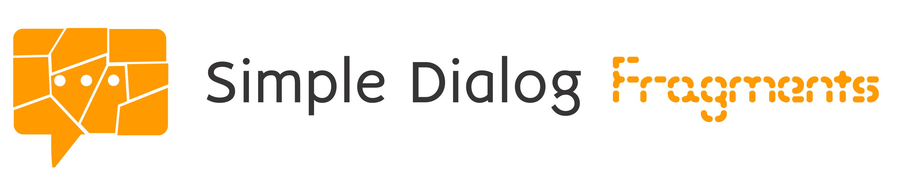

<p align="center" >
<picture>
  <source media="(prefers-color-scheme: dark)" srcset="media/logo_named_right_darkmode.png">
  <source media="(prefers-color-scheme: light)" srcset="media/logo_named_right.png">
  
</picture>
</p>

# SimpleDialogFragments

[](https://developer.android.com/about/dashboards/index.html#Platform)
[](https://search.maven.org/artifact/io.github.eltos/simpledialogfragments)
[](https://jitpack.io/#eltos/SimpleDialogFragments)
[](https://codeclimate.com/github/eltos/SimpleDialogFragments)
[](https://github.com/eltos/SimpleDialogFragments/actions/workflows/build.yml)
[](https://github.com/eltos/SimpleDialogFragments#license)


SimpleDialogFragments Library is a collection of easy to use and extendable DialogFragment's for Android.
It is fully compatible with rotation changes and can be implemented with only a few lines of code.

A new approach of result handling ensures data integrity over rotation changes, that many other libraries lack.


|[🧑‍💻 API](https://eltos.github.io/SimpleDialogFragments)|[ℹ️ Wiki](https://github.com/eltos/SimpleDialogFragments/wiki)|[🚀 Releases](https://github.com/eltos/SimpleDialogFragments/releases)|
|-|-|-|

|[🖼️ Screenshots](https://github.com/eltos/SimpleDialogFragments/wiki/Showcase)|[📱 Demo](https://github.com/eltos/SimpleDialogFragments/releases/download/v3.4/testApp.apk)|[🪙 Donate](https://github.com/sponsors/eltos) |
|-|-|-|


### Features

* Common dialogs that can be used with few lines of code
  * Alert dialogs
  * Input and checkbox dialogs with suggestions and validations
  * Filterable single- / multi-choice dialogs
  * Color pickers (palettes and/or HSV)
  * Extensive forms
  * Date and time pickers
  * Pin code dialog
  * Progress dialogs
* Easy result handling even after rotation changes
* Persistence on rotation changes
* Material design
* Customizable and extendable dialogs


## Usage

Check the [release page](https://github.com/eltos/SimpleDialogFragments/releases) for the latest and older versions:

In your module level ``build.gradle`` when using [mavenCentral](https://search.maven.org/artifact/io.github.eltos/simpledialogfragments):
```groovy
dependencies {
    implementation 'io.github.eltos:simpledialogfragments:3.6.4'
}
```
or if using [JitPack](https://jitpack.io/#eltos/SimpleDialogFragments):
```groovy
dependencies {
    implementation 'com.github.eltos:simpledialogfragments:v3.6.4'
}
```

### Building dialogs

Building dialogs is very easy and short handed:

```java
SimpleDialog.build()
            .title(R.string.hello)
            .msg(R.string.hello_world)
            .show(this);
```

Check the [wiki pages](https://github.com/eltos/SimpleDialogFragments/wiki) for instructions and examples on how to build the different dialogs available.

### Receive Results
Supply a tag when showing the dialog and let the hosting Activity or Fragment implement the `SimpleDialog.OnDialogResultListener`.  
For details, please refere to the [wiki pages](https://github.com/eltos/SimpleDialogFragments/wiki/SimpleDialog#receiving-results).

```java
@Override
public boolean onResult(@NonNull String dialogTag, int which, @NonNull Bundle extras) {
    if (YES_NO_DIALOG.equals(dialogTag) && which == BUTTON_POSITIVE){
        // ...
        return true;
    }
    if (LIST_DIALOG.equals(dialogTag) && which == BUTTON_POSITIVE){
        ArrayList<Integer> pos = extras.getIntegerArrayList(SimpleListDialog.SELECTED_POSITIONS);
        // ...
        return true;
    }
    if (REGISTRATION_DIALOG.equals(dialogTag) && which == BUTTON_POSITIVE){
        String username = extras.getString(USERNAME);
        String password = extras.getString(PASSWORD);
        // ...
        return true;
    }
    // ...
    return false;
}

```

## Extensions
Known extensions and projects using this library:
- [File/Folder picker](https://github.com/isabsent/FilePicker) (see [#30](https://github.com/eltos/SimpleDialogFragments/issues/30))

## License

Copyright 2017-2022 Philipp Niedermayer ([github.com/eltos](https://github.com/eltos))

Licensed under the [Apache License 2.0](http://www.apache.org/licenses/LICENSE-2.0)  


You may only use, copy, modify, merge, publish, distribute, sublicense, and/or sell copies of the Software in compliance with the License. For more information visit http://www.apache.org/licenses/LICENSE-2.0  
The above copyright notice alongside a copy of the Apache License shall be included in all copies or substantial portions of the Software not only in source code but also in a license listing accessible by the user.  

